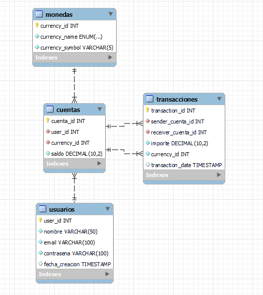

<div align="center">
  <br>
    <h2><strong>Proyecto SQL - VirtualWallet</strong> </br>  </h2>
    <span>Evaluacion Integradora Modulo 3 SQL</span><br>
    <span>Juan Pino Contreras.</span>
</div>

****
## 📃 Acerca del proyecto

Esta base de datos VirtualWallet es una aproximacion a una base de datos real diseñado para gestionar operaciones financieras relacionadas con cuentas de usuario, monedas y transacciones entre cuentas en un entorno SQL. El objetivo es demostrar conceptos y habilidades en modelado de datos, implementación de esquemas relacionales, consultas y desarrollo de procedimientos almacenados para la ejecución segura de transacciones.


## ⚙️ Diagrama y Componentes de la base de datos

### **Tablas**
  - **usuarios**: Almacena datos de usuarios nombres, correos electrónicos y contraseñas encriptadas y fecha de creacion.
  - **monedas**: Permite el registro de 3 diferentes monedas, USD, EUR, YEN, con sus respectivos simbolos.
  - **cuentas**: Gestiona las cuentas de usuario vinculadas a distintas monedas, contiene los saldos y relaciones de clave foranea. Cada usuario puede contener hasta 3 cuentas, cada una en un tipo de moneda diferente.
  - **transacciones**: Registra movimientos entre cuentas, distinguiendolas entre cuenta recepetora y cuenta que envia dinero el la moneda correspondiente.

### Relaciones

- **usuarios y cuentas** 
    - relación de __1:N__,  un usuario puede tener muchas cuentas. La PK de usuario es clave foranea en cuentas, siendo la tabla fuerte de la relacion.
- **monedas y cuentas**
    - relacion de __1:N__, una moneda puede ser usada en muchas cuentas. La primary key de una moneda se representa en la tabla cuentas como FK currency_id.
- **cuentas y transacciones**
    - relacion de __1:N__, una cuenta puede estar en muchas transacciones. La clave primaria de cuentas se representa en la tabla transacciones de dos formas; como sender_cuenta_id y receiver_cuenta_id, haciendo alucion donde una cuenta es quien envia dinero, y otra cuenta es la que recibe.

### Insercion de datos
- **usuarios**:  Insertamos 3 usuarios de prueba; Juan Pérez, María González,Pedro Ramirez.
- **monedas**: Insertamos 3 monedas de prueba; USD, EUR, YEN.
- **cuentas**: Insertamos 3 cuentas por cada usuario, uno en cada tipo de moneda diferente, con un saldo inicial de 1000.0. 9 cuentas en total.

### Porcedimientos
__Procedure Transaccion()__
Este procedimiento Facilita y controla las transacciones entre las cuentas, de forma que con cada transaccion realizada se mantenga la coherencia y la integridad de los datos. Para realizar una transaccion llamamos este procedimiento pasandole por parametros:
- _id de la cuenta que envia_
- _id de la cuenta que recibe_
- _monto a transferir_
- _tipo de moneda_.

Dentro del procedimiento se realiza una Transaction donde se siguen los siguiente pasos:
    
1. _UPDATE_ de las cuentas involucradas. A la cuenta de origen en su campo _saldo_ restamos el monto y a la cuenta destino en su campo _saldo_ sumamos el monto.
2. _IF saldo_cuenta_origen < monto_ Aqui validamos si la cuenta de origen tiene el saldo suficiente para enviar el monto. Si no se cumple ejecutamos **ROLLBACK** para salir del procedimiento y cancelar el UPDATE realizado anteriormente.
3. _IF tipo_moneda_sender != tipo_moneda_receiver_ Condicional if para validar si las cuentas involucradas son del mismo tipo de moneda. Si no se cumple ejecutamos **ROLLBACK**.
4. _INSERT INTO transacciones_ Registramos la transaccion con los valores recibidos.
5. COMMIT Confirmamos que todas las operaciones DML como UPDATE a la tabla cuenta e INSERT a la tabla transaccion estan correctas segun las condiciones definidas.

Para utilizar este PROCEDURE lo llamamos por su nombre indicandole los parametros, por ejemlo:
- Envio de 150.00 Dolares de la cuenta 1 a la cuenta 7

    ```bash
    CALL Transaccion(1, 7, 150.00, 1);
    ```

## 🔍Consultas SQL
Realizamos variadas consultas para poner a prueba la integridad de la base de datos, sus relaciones y la coherencia de los datos ingresados. 
- Utilizamos **SELECT** para recuperar datos de las tablas.
- Aplicamos **JOIN** entre las tablas usando las claves primarias la cláusula _USING_ y _ON_.
- Filtramos los resultados usando la condición **WHERE**.
- Sentencia DML **DELETE** usada para eliminar datos de una transacción.
- Con la sentencia DDL **UPDATE** para cambiar el valor de una columna
- Usamos la sentencia DDL **ALTER TABLE** para cambiar el nombre de una columna.


## 🔩 Requisitos

1. **Configuración del Entorno**:
   - Asegúrate de tener MySQL Workbench 8.0 Community Edition instalado en tu sistema. Puedes descargarlo desde el [sitio web oficial de MySQL](https://www.mysql.com/).
   - Configura una conexión a tu servidor MySQL local o remoto en MySQL Workbench.

2. **Descarga y Clonación**:
   - Clona este repositorio en tu máquina local utilizando Git:
     ```bash
     git clone https://github.com/Jvbass/BilleteraVirtualDB
     ```


## 🤝 Contribuciones

¡Las contribuciones siempre son bienvenidas! Si tienes ejercicios adicionales, mejoras en las soluciones existentes o cualquier otro aporte que creas que pueda beneficiar a otros usuarios, no dudes en abrir un [_pull request_](https://github.com/Jvbass/BilleteraVirtualDB/pulls) o contactarme.

#### _Gracias por tu interés en este proyecto. Si tienes algun comentario o duda sobre este o cualquier otro proyecto no dudes en contactarme._
###### ¡Espero tus _PR_!👋
